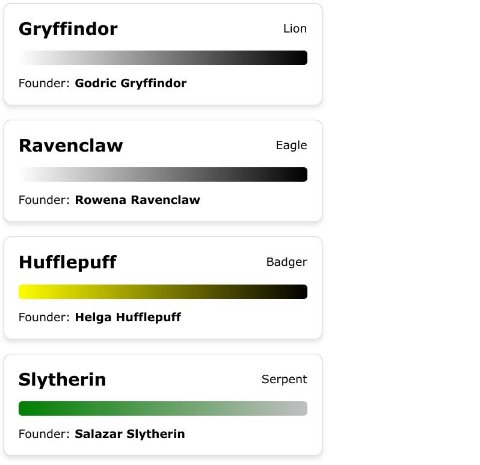

**React.js Exercise**

We want to create a simple react application that will call the following API and render the data with a design **identical** to the one below. While the data are loading, show a spinner. Use font Verdana.

Note that the gradient is created using the house colors. If the house color(s) don’t exist in CSS, just use white to black as shown in the design.

Also note that the data are just an example, assume that the actual data have hundreds of houses that all need to be rendered correctly and dynamically.

**API**: <https://wizard-world-api.herokuapp.com/houses>

**Design**

React.js Exercise 1
